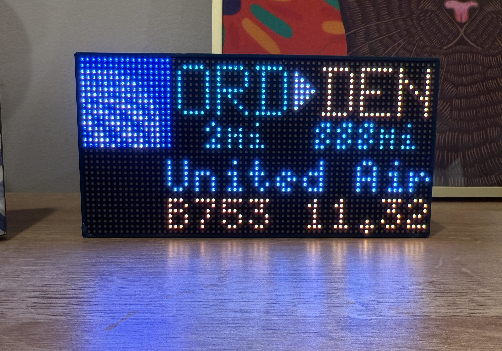
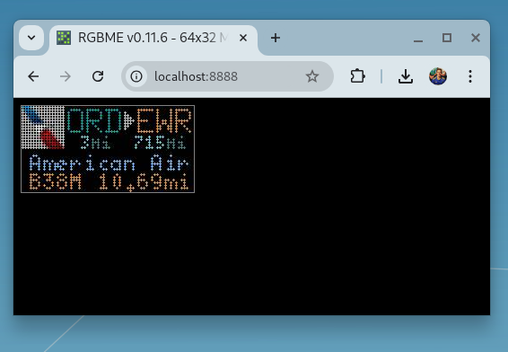

# ADSB Plane Tracker

This repo was initially forked from [c0wsaysmoo' repository](https://github.com/c0wsaysmoo/plane-tracker-rgb-pi). I initially discovered [their reddit post on r/delta](https://www.reddit.com/r/delta/comments/1g4wsi6/weird_delta_flight_over_my_house_this_morning/) and decided to fork it. After many modifications to make it my own I decided to detach it, as it became very different on the backend from theirs, so much credit to them for getting me started here.

## Some Images
#### The device:

#### The Emulator:

## Getting Started: Install System Dependencies
### pipenv
#### Ubuntu:
`sudo apt install pipenv`

#### Fedora:
`sudo dnf install pipenv`

### pyenv
#### Ubuntu:
`sudo apt install -y make build-essential libssl-dev zlib1g-dev libbz2-dev libreadline-dev libsqlite3-dev wget curl llvm libncursesw5-dev xz-utils tk-dev libxml2-dev libxmlsec1-dev libffi-dev liblzma-dev`

`curl https://pyenv.run | bash`

`export PYENV_ROOT="$HOME/.pyenv"`

`[[ -d $PYENV_ROOT/bin ]] && export PATH="$PYENV_ROOT/bin:$PATH"`

`eval "$(pyenv init -)"`

#### Fedora:
`sudo dnf builddep python3`

`curl https://pyenv.run | bash`

`export PYENV_ROOT="$HOME/.pyenv"`

`[[ -d $PYENV_ROOT/bin ]] && export PATH="$PYENV_ROOT/bin:$PATH"`

`eval "$(pyenv init -)"`

## Getting Started: Installing project dependencies
`cd plane-tracker-rgb-pi`

`pipenv shell`

`pipenv install --dev`

## Configuration
`src/config.py`
* Update your ZIP and Country code to tell the app where you are. NOTE see the bottom of the file for a note regarding this.
* For development purposes, you can emulate the RGB display with a browser emulator `RGBMatrixEmulator`. You'll want to search for all strings in the repo "from rgbmatrix" and replace it with "from RGBMatrixEmulator" to run in a browser.

### Display Scale Factor (New!)
The `DISPLAY_SCALE_FACTOR` setting in `config.py` controls the size of the display when running on non-Raspberry Pi systems (like development environments).

* **Options**: `2`, `3`, or `4`
* **Default**: `3` (recommended for most screens)
* **Effect**: Multiplies the base 64×32 matrix dimensions
  - `DISPLAY_SCALE_FACTOR = 2` → 128×64 display
  - `DISPLAY_SCALE_FACTOR = 3` → 192×96 display (default)
  - `DISPLAY_SCALE_FACTOR = 4` → 256×128 display

This setting automatically:
- Adjusts display dimensions
- Loads appropriately scaled fonts (2x, 3x, or 4x)
- Uses higher resolution logos (48×48) for scale factors ≥ 3

**Note**: This setting only affects non-Raspberry Pi systems. On actual Raspberry Pi hardware, the display always uses the native 64×32 resolution.

### Emulator Display Configuration
When running in emulator mode, the display automatically scales based on the `DISPLAY_SCALE_FACTOR` setting in `config.py`. You can further customize the visual appearance by modifying the `emulator_config.json` files. There are two configuration files:
* `emulator_config.json` (root level) - Default configuration
* `src/emulator_config.json` - Alternative configuration used by some scripts

The RGB matrix display is **64 pixels wide × 32 pixels tall** on Raspberry Pi hardware. On development systems, this is automatically scaled by the `DISPLAY_SCALE_FACTOR` (default: 3x = 192×96). The `pixel_size` parameter in the emulator config controls the visual size of each LED pixel in the browser window.

#### Key Configuration Options:
* **`pixel_size`**: Size of each LED pixel in the browser (e.g., 12 means each LED is 12×12 pixels)
  - Adjusts the visual size of the emulator window
  - With default 3x scale (192×96): pixel_size of 5-8 works well for most screens
  - With 2x scale (128×64): pixel_size of 8-12 works well
  - With 4x scale (256×128): pixel_size of 4-6 works well
  - Formula: `browser_width = (64 × DISPLAY_SCALE_FACTOR) × pixel_size`
* **`pixel_style`**: Visual style of LED pixels
  - `"circle"` - Rounded LED appearance (recommended)
  - `"square"` - Sharp-edged appearance
* **`pixel_outline`**: Width of outline around each pixel (0 for no outline)
* **`image_border`**: Whether to show a border around the entire display (true/false)

After modifying the configuration, restart the application to see the changes.

## Run the App*
`scripts/start-tracker.sh`

Open a browser and navigate to `localhost:8888`

## Footnotes

More work will be required if you want to get your coordinates based on ZIP code. This app is written in such a way that it depends on RapidAPI with an an API key stored in AWS Secrets. You'll need to create an account and an API key, and store it in AWS Secrets (or any cloud secrets provider, but you'll need to update the code)

If you **don't** want to utilize the RapidAPI's forward geocoding endpoint, that's okay too; you can simply update the `LOCATION_COORDINATES_OVERRIDE` value in `src/config.py` to use speific coordinates (like that of your home, for instance), and the geo service will know to use those rather than querying the API endpoint. You'll still get an error from the authentication service, but it won't cause the app to crash. It follows the same format as the `LOCATION_COORDINATES_DEFAULT` value; in fact, you can also just keep that populated, and when the auth services fails to retrieve an API token, the geo service will fall back to the default value. So you more or less have two options when it comes to avoiding the use of a 3rd party API for getting your coordinates based on your ZIP and country codes.
